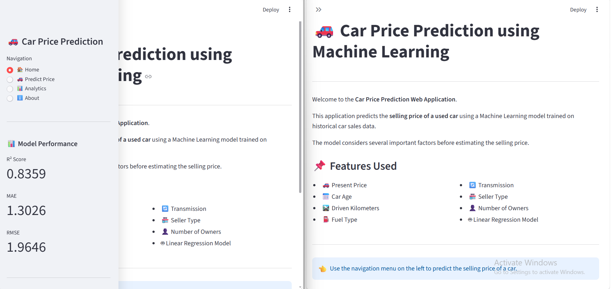
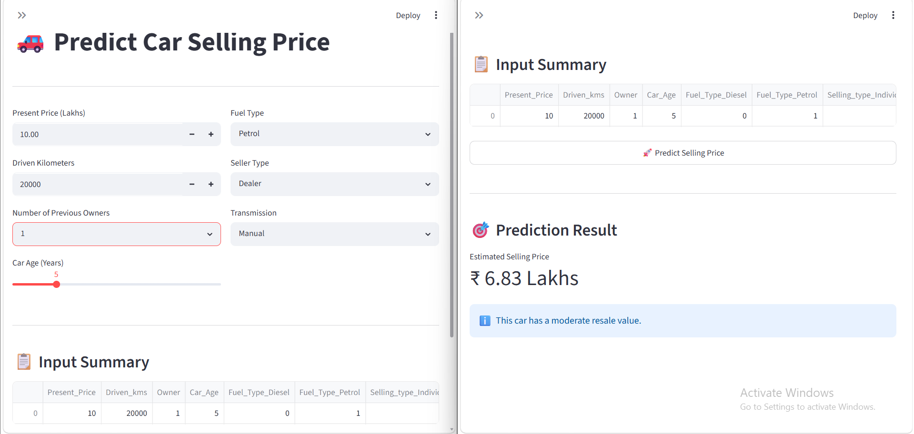
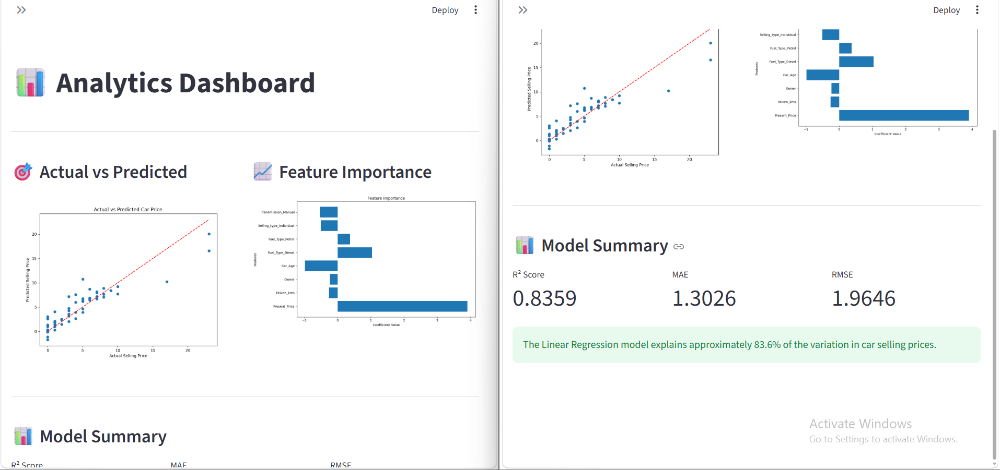
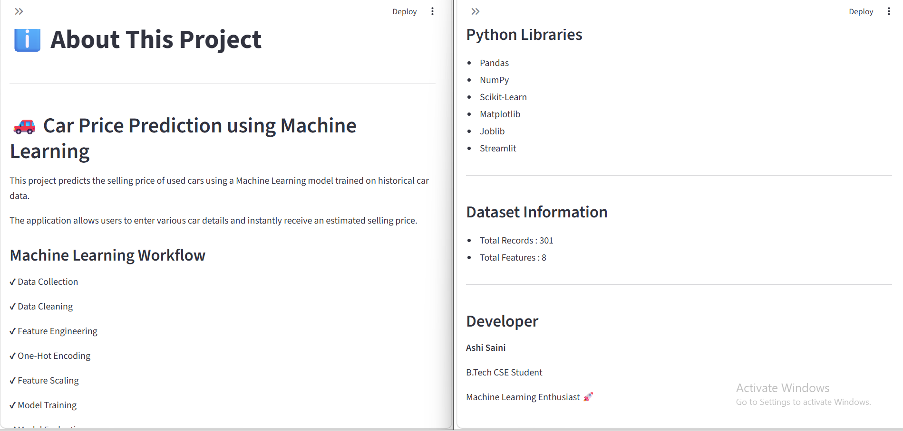

# 🚗 Car Price Prediction using Machine Learning

A Machine Learning web application that predicts the **selling price of a used car** based on its specifications such as present price, car age, fuel type, transmission, seller type, driven kilometers, and number of previous owners.

Built using **Python, Scikit-Learn, and Streamlit**.

---


## 📌 Project Overview

This project uses a **Linear Regression** model to estimate the selling price of a used car from various input features. The application provides an interactive Streamlit interface where users can enter car details and instantly receive the predicted selling price.

---

## ✨ Features

- 🚗 Predict used car selling price
- 📊 Interactive Streamlit Dashboard
- 📈 Actual vs Predicted Price Visualization
- 📉 Feature Importance Chart
- 📋 Input Summary Table
- 🎯 Clean and User-Friendly Interface
- 📱 Responsive Design

---

## 🛠️ Technologies Used

- Python
- Pandas
- NumPy
- Scikit-Learn
- Matplotlib
- Joblib
- Streamlit

---

## 📂 Dataset Information

| Attribute | Value |
|-----------|-------|
| Dataset | Car Price Dataset |
| Total Records | 301 |
| Total Features | 8 |
| Target Variable | Selling_Price |

---

## 📊 Machine Learning Workflow

- Data Collection
- Data Cleaning
- Feature Engineering
- One-Hot Encoding
- Feature Scaling
- Model Training
- Model Evaluation
- Model Deployment

---

## 🤖 Machine Learning Model

**Algorithm Used**

- Linear Regression

---

## 📈 Model Performance

| Metric | Score |
|---------|-------|
| R² Score | **0.8359** |
| MAE | **1.3026** |
| RMSE | **1.9646** |

---

# 📸 Application Screenshots

## 🏠 Home Page



---

## 🚗 Prediction Page



---

## 📊 Analytics Dashboard



---

## 📈 About 



---

## 📁 Project Structure

```text
Car Price Prediction/
│
├── app.py
├── train_model.py
├── requirements.txt
├── README.md
│
├── dataset/
│      car data.csv
│
├── models/
│      best_model.pkl
│      scaler.pkl
│
├── images/
│      analytics.png
│      feature_importance.png
│      home.png
│      prediction_result.png
```

---

## ⚙️ Installation

Clone the repository

```bash
git clone <your-github-repository-link>
```

Move to the project directory

```bash
cd Car-Price-Prediction
```

Install the required libraries

```bash
pip install -r requirements.txt
```

Run the application

```bash
streamlit run app.py
```

---

## 💡 Future Improvements

- Random Forest Regressor
- XGBoost Regressor
- Hyperparameter Tuning
- Improved UI/UX
- Model Comparison Dashboard

---

## 👨‍💻 Developer

**Ashi Saini**

B.Tech CSE Student

Machine Learning Enthusiast

---


